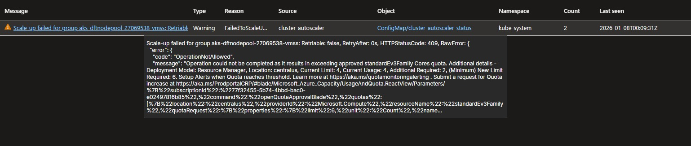

# ⚙️ VideoCore Worker

<div align="center">

[](https://sonarcloud.io/summary/new_code?id=FIAP-SOAT-TECH-TEAM_videocore-worker)
[](https://sonarcloud.io/summary/new_code?id=FIAP-SOAT-TECH-TEAM_videocore-worker)
[](https://sonarcloud.io/summary/new_code?id=FIAP-SOAT-TECH-TEAM_videocore-worker)
[](https://sonarcloud.io/summary/new_code?id=FIAP-SOAT-TECH-TEAM_videocore-worker)

</div>

Microsserviço de processamento de vídeo do ecossistema VideoCore, responsável por extrair frames de vídeos utilizando FFmpeg e gerar screenshots. Desenvolvido como parte do curso de Arquitetura de Software da FIAP (Hackaton).

<div align="center">
  <a href="#visao-geral">Visão Geral</a> •
  <a href="#repositorios">Repositórios</a> •
  <a href="#tecnologias">Tecnologias</a> •
  <a href="#infra">Infraestrutura</a> •
  <a href="#estrutura">Estrutura</a> •
  <a href="#terraform">Terraform</a> •
  <a href="#arquitetura">Arquitetura</a> •
  <a href="#dominio">Domínio</a> •
  <a href="#dbtecnicos">Débitos Técnicos</a> •
  <a href="#limitacoesqt">Limitações de Quota</a> •
  <a href="#deploy">Fluxo de Deploy</a> •
  <a href="#instalacao">Instalação</a> •
  <a href="#contribuicao">Contribuição</a>
</div><br>

> 📽️ Vídeo de demonstração da arquitetura: [https://youtu.be/k3XbPRxmjCw](https://youtu.be/k3XbPRxmjCw)<br>

---

<h2 id="visao-geral">📋 Visão Geral</h2>

<details>
<summary>Expandir para mais detalhes</summary>

O **VideoCore Worker** é o microsserviço responsável pelo processamento de vídeos do sistema. Ele escuta eventos de criação de blobs no Azure Storage via Service Bus, realiza a extração de frames utilizando **FFmpeg (JavaCV)** e publica os screenshots processados de volta no Blob Storage.

### Principais Responsabilidades

- **Processamento de Vídeo**: Extração de frames em intervalos configuráveis via FFmpeg
- **Download**: Busca vídeos do Azure Blob Storage para processamento
- **Upload**: Envia screenshots e arquivos ZIP para o Blob Storage
- **Eventos**: Consome e publica eventos de status via Azure Service Bus
- **Gerenciamento de Arquivos**: Controle de arquivos temporários durante processamento

### Fluxo de Processamento

```text
1. BlobCreated Event (Service Bus)
        ↓
2. Download do vídeo (Azure Blob Storage)
        ↓
3. Extração de frames (FFmpeg/JavaCV)
        ↓
4. Upload de screenshots (Azure Blob Storage)
        ↓
5. Publicação de status (Service Bus → Reports)
        ↓
6. Limpeza de arquivos temporários
```

### Status de Processamento

| Status | Descrição |
|--------|-----------|
| `STARTED` | Upload recebido, processamento iniciado |
| `PROCESSING` | Extração de frames em andamento |
| `COMPLETED` | Screenshots prontos para download |
| `FAILED` | Erro no processamento |

</details>

---

<h2 id="repositorios">📁 Repositórios do Ecossistema</h2>

<details>
<summary>Expandir para mais detalhes</summary>

| Repositório | Responsabilidade | Tecnologias |
|-------------|------------------|-------------|
| **videocore-infra** | Infraestrutura base | Terraform, Azure, AWS |
| **videocore-db** | Banco de dados | Terraform, Azure Cosmos DB |
| **videocore-auth** | Microsserviço de autenticação | C#, .NET 9, ASP.NET |
| **videocore-reports** | Microsserviço de relatórios | Java 25, GraalVM, Spring Boot 4, Cosmos DB |
| **videocore-worker** | Microsserviço de processamento de vídeo | Java 25, GraalVM, Spring Boot 4, FFmpeg |
| **videocore-notification** | Microsserviço de notificações | Java 25, GraalVM, Spring Boot 4, SMTP |
| **videocore-frontend** | Interface web do usuário | Next.js 16, React 19, TypeScript |

</details>

---

<h2 id="tecnologias">🔧 Tecnologias</h2>

<details>
<summary>Expandir para mais detalhes</summary>

| Categoria | Tecnologia |
|-----------|------------|
| **Linguagem** | Java 25 (GraalVM) |
| **Framework** | Spring Boot 4.0.1 |
| **Processamento** | JavaCV, FFmpeg |
| **Mensageria** | Azure Service Bus |
| **Storage** | Azure Blob Storage |
| **Observabilidade** | OpenTelemetry, Micrometer, Logstash |
| **Build** | Gradle |
| **Compilação** | GraalVM Native Image |
| **Container** | Docker |
| **Orquestração** | Kubernetes (Helm), KEDA |
| **IaC** | Terraform |
| **CI/CD** | GitHub Actions |
| **Qualidade** | SonarQube |

</details>

---

<h2 id="infra">🌐 Infraestrutura</h2>

<details>
<summary>Expandir para mais detalhes</summary>

### ☸️ Recursos Kubernetes

| Recurso | Descrição |
|------------------------|-----------------------------------------------------------------------------------------------------|
| **Deployment** | Pods com health probes, limites de recursos e variáveis de ambiente |
| **ConfigMap** | Configurações não sensíveis |
| **SecretProviderClass** | Integração com Azure Key Vault para gerenciamento de segredos |
| **KEDA ScaledObject** | Escalabilidade automática baseada em métricas de fila (Service Bus) |
| **KEDA TriggerAuth** | Autenticação para escalonamento KEDA usando credenciais externas |

### 🔌 Integrações

| Serviço | Tipo | Descrição |
|---------|------|-----------|
| **Azure Service Bus** | Assíncrona | Consumo de `BlobCreated` events + publicação de status |
| **Azure Blob Storage** | Síncrona | Download de vídeos, upload de screenshots e ZIPs |
| **FFmpeg (JavaCV)** | Local | Extração de frames de vídeo |

### 🔐 Azure Key Vault Provider (CSI)

- Sincroniza secrets do Azure Key Vault com Secrets do Kubernetes
- Monta volumes CSI com `tmpfs` dentro dos Pods
- Utiliza o CRD **SecretProviderClass**

> ⚠️ Caso o valor de uma secret seja alterado no Key Vault, é necessário **reiniciar os Pods**, pois variáveis de ambiente são injetadas apenas na inicialização.
>
> Referência: <https://learn.microsoft.com/en-us/azure/aks/csi-secrets-store-configuration-options>

### 👁️ Observabilidade

- **Logs**: Envio para `NewRelic` via `Open Telemetry Collector` utilizando protocolo `OTLP + GRPC`
- **Métricas**: Envio para `NewRelic` via `Open Telemetry Collector` utilizando protocolo `OTLP + GRPC`
- **Tracing**: Envio para `NewRelic` via `Open Telemetry Collector` utilizando protocolo `OTLP + GRPC`
- **Dashboards**: Visualização na UI do `NewRelic`

</details>

---

<h2 id="estrutura">📦 Estrutura do Projeto</h2>

<details>
<summary>Expandir para mais detalhes</summary>

```text
videocore-worker/
├── worker/
│   ├── build.gradle              # Dependências (JavaCV, FFmpeg)
│   ├── src/main/
│   │   ├── java/com/soat/fiap/videocore/worker/
│   │   │   ├── WorkerApplication.java
│   │   │   ├── core/
│   │   │   │   ├── domain/
│   │   │   │   ├── usecases/
│   │   │   │   └── interfaceadapters/mapper/
│   │   │   └── infrastructure/
│   │   │       ├── in/event/azsvcbus/
│   │   │       │   ├── listener/
│   │   │       │   ├── handler/
│   │   │       │   └── config/
│   │   │       ├── out/
│   │   │       │   ├── process/        # FFmpeg
│   │   │       │   ├── persistence/
│   │   │       │   └── event/azsvcbus/
│   │   │       └── common/
│   │   └── resources/
│   │       ├── application.yaml
│   │       ├── application-local.yaml
│   │       ├── application-prod.yaml
│   │       └── logback-spring.xml
│   └── src/test/
├── docker/
│   └── Dockerfile                # GraalVM + FFmpeg bindings
├── kubernetes/
│   ├── Chart.yaml                # Helm Chart
│   ├── values.yaml               # Configurações Helm
│   └── templates/
│       ├── deploymentset.yaml
│       └── crd/
│           ├── keda/             # ScaledObject + TriggerAuth
│           └── azure_secrets_provider/
├── terraform/
│   ├── main.tf                   # Helm deployment
│   └── variables.tf
├── docs/                         # Assets de documentação
└── .github/workflows/
    ├── ci.yaml                   # Build, test, FFmpeg setup
    └── cd.yaml                   # Terraform apply
```

</details>

---

<h2 id="terraform">🗄️ Módulos Terraform</h2>

<details>
<summary>Expandir para mais detalhes</summary>

O código `HCL` desenvolvido segue uma estrutura modular:

| Módulo | Descrição |
|--------|-----------|
| **helm** | Implantação do Helm Chart da aplicação, consumindo as informações necessárias via `Terraform Remote State` |

> ⚠️ Os outpus criados são consumidos posteriormente em pipelines via `$GITHUB_OUTPUT` ou `Terraform Remote State`, para compartilhamento de informações. Tornando, desta forma, dinãmico o provisionamento da infraestrutura.

</details>

---

<h2 id="arquitetura">🧱 Arquitetura</h2>

<details>
<summary>Expandir para mais detalhes</summary>

### 📌 Princípios Adotados

- **DDD**: Bounded context de pedido isolado
- **Clean Architecture**: Domínio independente de frameworks
- **Separação de responsabilidades**: Cada camada tem responsabilidade bem definida
- **Independência de frameworks**: Domínio não depende de Spring ou outras bibliotecas
- **Testabilidade**: Lógica de negócio isolada facilita testes unitários
- **Inversão de Dependência**: Classes utilizam abstrações, nunca implementações concretas diretamente
- **Injeção de Dependência**: Classes recebem via construtor os objetos que necessitam utilizar
- **SAGA Coreografada**: Comunicação assíncrona via eventos
- **Comunicação Síncrona Resiliente**: Embora ainda não possua comunicações síncronas, apenas assíncronas, caso o projeto evolua, serão implementadas usando padrões de resiliência como Circuit Beaker e Service Discovery
- **Observabilidade**: O microsserviço está inteiramente instrumentado, com logs, tracing e métricas, via API do `Open Telemetry` (baixo acoplamento). Para logs, adota-se o conceito de **Log Canônico**.

### 🎯 Clean Architecture

O projeto segue os princípios de **Clean Architecture** com separação clara de responsabilidades:

```text
core/
├── domain/           # Entidades de vídeo e regras de negócio
├── usecases/         # Casos de uso de processamento
└── interfaceadapters/
    └── mapper/       # Conversão de eventos ↔ domínio

infrastructure/
├── in/               # Adaptadores de entrada
│   └── event/azsvcbus/
│       ├── listener/     # ProcessListener (Service Bus)
│       ├── handler/      # ProcessHandler (message handling)
│       └── config/       # ProcessConfig (Spring config)
├── out/                  # Adaptadores de saída
│   ├── process/          # FfmpegProcessor (video processing)
│   ├── persistence/
│   │   ├── file/         # DefaultFileSource (temp files)
│   │   └── blobstorage/  # AzureBlobStorageRepository
│   └── event/azsvcbus/   # AzSvcEventSender (status publishing)
└── common/           # Configurações, sources, exceções
```

### 📊 Diagrama de Arquitetura: Saga Coreografado


### 📊 Diagrama de Arquitetura: Processamento do Vídeo


Key Points

- A implementação é bem separada por responsabilidades. O controller só orquestra, os use cases encapsulam regras de aplicação e os gateways escondem `Azure`, `filesystem` e `FFmpeg`. Isso deixa o fluxo legível e reduz acoplamento;
- Há rastreabilidade operacional consistente. O código adiciona contexto canônico do evento, propaga `traceId` ao evento de status e limpa o contexto no `finally`, o que ajuda bastante em troubleshooting distribuído;
- Há validação de domínio para impedir, entre outras coisas, a configuração inconsistente de corte de frames versus duração do vídeo, evitando processamento inválido cedo;
- Prevenção de `OOM`:
  - O vídeo entra como stream vindo do Blob Storage, em vez de ser materializado inteiro na heap;
  - `Stream` é copiado para arquivo temporário local com operação de I/O de arquivo, não para array em memória. Isso é um dos principais mecanismos `anti-OOM` da solução;
  - A saída das imagens também é streamada direto para um blob ZIP, sem acumular todas as imagens na memória antes de subir;
  - O processamento é incremental: a cada iteração ele captura um frame, grava a `entry` no ZIP e segue. Não existe coleção em memória contendo todos os frames;
  - O frame convertido é descartado logo após a escrita no ZIP com flush da imagem, o que ajuda a reduzir retenção de memória gráfica;
  - Os recursos mais pesados usam fechamento automático com `try-with-resources`: `InputStream` do vídeo, `ZipOutputStream` e `FFmpegFrameGrabber`. Isso reduz vazamento de handles e retenção indireta de memória.

</details>

---

<h2 id="dominio">📽️ Domínio</h2>

<details>
<summary>Expandir para mais detalhes</summary>

### 📖 Dicionário de Linguagem Ubíqua

| Termo | Descrição |
|-------|-----------|
| **Vídeo** | Arquivo enviado pelo usuário para ser processado, analisado e convertido em imagens. |
| **Processamento de Vídeo** | Sequência de etapas automáticas para analisar, extrair imagens e gerar dados a partir de um vídeo. |
| **Frame** | Imagem individual extraída de um vídeo em um instante específico. |
| **Extração de Frames** | Processo de capturar imagens do vídeo em intervalos definidos, normalmente a cada minuto. |
| **Screenshot** | Imagem gerada a partir de um frame do vídeo, utilizada para visualização ou análise posterior. |
| **Duração do Vídeo** | Tempo total, em minutos, do vídeo enviado para processamento. |
| **Metadados** | Informações complementares sobre o vídeo, como nome, duração, formato e horários. |
| **Corte de Frame por Minuto** | Ponto do vídeo (em minutos) onde uma imagem foi extraída para análise. |
| **Nome do Vídeo** | Identificação do vídeo enviado pelo usuário, utilizada para referência e organização. |
| **Arquivo Temporário** | Cópia local do vídeo ou das imagens, utilizada durante o processamento antes do upload final. |
| **Arquivo ZIP** | Arquivo compactado contendo todas as imagens extraídas do vídeo, disponibilizado para download. |
| **Status do Processamento** | Situação atual do processamento do vídeo, como iniciado, em andamento, concluído ou com erro. |
| **Evento de Atualização de Status** | Comunicação enviada para outros sistemas informando mudanças no status do processamento do vídeo. |
| **Exclusão de Arquivo** | Remoção de arquivos temporários ou processados após o término do processamento. |
| **Download de Vídeo** | Ação de buscar o vídeo original do armazenamento para iniciar o processamento. |
| **Upload de Imagens** | Envio das imagens extraídas e arquivos ZIP para o armazenamento, tornando-os acessíveis ao usuário. |
| **Erro de Processamento** | Situação em que o processamento do vídeo falha, impedindo a geração das imagens ou do arquivo ZIP. |

### 📊 Diagrama de Domínio e Sub-Domínios (DDD Estratégico)


</details>

---

<h2 id="dbtecnicos">⚠️ Débitos Técnicos</h2>

<details>
<summary>Expandir para mais detalhes</summary>

| Débito | Descrição | Impacto |
|--------|-----------|---------|
| **Workload Identity** | Usar Workload Identity para Pods acessarem recursos Azure (atual: Azure Key Vault Provider) | Melhora de segurança e gestão de credenciais |
| **Migrar Linguagem Compilada** | Pelo workload deste microsserviço se tratar de `CPU-Bound`, para máximr performance, utilizou-se a `GraalVM` para criação de uma imagem nativa. Embora os ganhos sejam notórios, especificamente neste microsserviço que utiliza a biblioteca `OpenCV`, observou-se o uso intensivo de `JNI`, `Reflections`, entre outras coisas, e o compilador precisa conhecer tudo que for dinãmico em tempo de build [(Reachability Metadata)](worker/src/main/resources/META-INF/README.md). Neste sentido, utilizar uma linguagem nativamente compilada (Go, Rust...) pode trazer ganhos de manutenção no futuro | Melhora da manutenabilidade |
| **Implementar Outbox Pattern** | Inspirado no padrão `Transactional Outbox Pattern`, teoricamente destinado para atomicidade de publicação de eventos x persistência em bancos relacionais, pensar em uma maneira de garantir que o processamento do vídeo, a geração do zip e a publicação do evento sejam atômicas | Resiliência |
| **Implementar DLQ** | Implementar lógica de reprocessamento do vídeo em caso de falha | Resiliência |
| **Implementar BDD** | Utilizar abordagem BDD para desenvolvimento de testes de integração em fluxos críticos | Testabilidade |
| **Gestão de Storage Efêmero** | O microsserviço realiza o dump do vídeo em disco para evitar `OOM`. É necessário implementar políticas de limpeza rigorosas, Resource Limits `(ephemeral-storage)` e avaliar o uso de `RAMDisk (EmptyDir com Memory - tmpfs)` para evitar gargalos de `I/O` e exaustão de disco no nó do `AKS` | Estabilidade e Resiliência |
| **Criação FFmpegFrameGrabber** | Atualmente o `FFmpegFrameGrabber` é instanciado a cada captura dos Frames, viabilizando a separação de camadas do `Clean Arch`. Todavia, se o `Garbage Collector` não for rápido o suficiente entre as iterações, ou se houver um pequeno memory leak na `JNI (Java Native Interface)` do `JavaCV/FFmpeg`, o consumo de memória subirá em escada até o `OOM`. Portanto, avaliar possibilidade de mover o `grabber` para fora do `loop` fechando-o apenas no final | Segurança e Resiliência |

</details>

---

<h2 id="limitacoesqt">📉 Limitações de Quota (Azure for Students)</h2>

<details>
<summary>Expandir para mais detalhes</summary>

A assinatura **Azure for Students** impõe as seguintes restrições:

- **Região**: com base em uma policy específica de assinatura;

- **Quota de VMs**: Apenas **2 instâncias** do SKU utilizado para o node pool do AKS, tendo um impacto direto na escalabilidade do cluster. Quando o limite é atingido, novos nós não podem ser criados e dão erro no provisionamento de workloads.

### Erro no CD dos Microsserviços

Durante o deploy dos microsserviços, Pods podem ficar com status **Pending** e o seguinte erro pode aparecer:




**Causa**: O cluster atingiu o limite máximo de VMs permitido pela quota e não há recursos computacionais (CPU/memória) disponíveis nos nós existentes.

**Solução**: Aguardar a liberação de recursos de outros pods e reexecutar CI + CD.

</details>

---

<h2 id="deploy">⚙️ Fluxo de Deploy</h2>

<details>
<summary>Expandir para mais detalhes</summary>

### Pipeline CI

1. **Build**: JDK 25, Gradle com cache
2. **FFmpeg**: Setup de binários FFmpeg
3. **Testes**: Execução de testes automatizados
4. **Terraform**: Format, validate, plan

### Pipeline CD

1. **Terraform Apply**: Provisionamento via Helm no AKS
2. **Docker**: Build de imagem GraalVM Native Image + FFmpeg
3. **Registry**: Push para Azure Container Registry (ACR)

### Autenticação das Pipelines

- **Azure:**
  - **OIDC**: Token emitido pelo GitHub
  - **Azure AD Federation**: Confia no emissor GitHub
  - **Service Principal**: Autentica sem secret

### Proteções

- Branch `main` protegida
- Nenhum push direto permitido
- Todos os checks devem passar

### Ordem de Provisionamento

```text
1. videocore-infra          (AKS, VNET, APIM, etc)
2. videocore-db             (Cosmos DB)
3. videocore-auth           (Microsserviço de autenticação)
4. videocore-reports        (Microsserviço de relatórios)
5. videocore-worker         (Microsserviço de processamento)
6. videocore-notification   (Microsserviço de notificações)
7. videocore-frontend       (Aplicação SPA Web)
```

</details>

---

<h2 id="instalacao">🚀 Instalação e Uso</h2>

<details>
<summary>Expandir para mais detalhes</summary>

### Desenvolvimento Local

```bash
# Clonar repositório
git clone https://github.com/FIAP-SOAT-TECH-TEAM/videocore-worker.git
cd videocore-worker/worker

# Configurar variáveis de ambiente
cp env-example .env

# Compilar
./gradlew build

# Executar
./gradlew bootRun

# Executar testes
./gradlew test
```

### Health Check

Após iniciar a aplicação:
- **Actuator**: http://localhost:${SERVER_PORT}/actuator/health

</details>

---

<h2 id="contribuicao">🤝 Contribuição</h2>

<details>
<summary>Expandir para mais detalhes</summary>

### Fluxo de Contribuição

1. Crie uma branch a partir de `main`
2. Implemente suas alterações
3. Execute os testes: `./gradlew test`
4. Abra um Pull Request
5. Aguarde aprovação de um CODEOWNER

### Licença

Este projeto está licenciado sob a MIT License.

</details>

---

<div align="center">
  <strong>FIAP - Pós-graduação em Arquitetura de Software</strong><br>
  Hackaton (Tech Challenge 5)
</div>